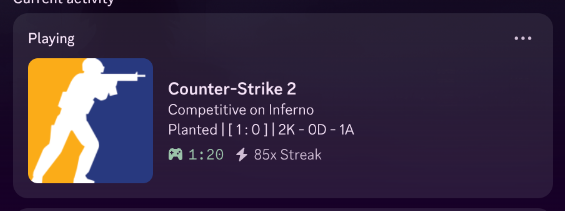

# cs2 presence

discord rich presence for counter strike 2.

## preview



## download

| platform    | link                                                                                                                                                                                          |
| ----------- | --------------------------------------------------------------------------------------------------------------------------------------------------------------------------------------------- |
| **windows** | [latest](https://github.com/kibibites/cs2-presence/releases/download/1.1.1/cs2-presence.exe.xz) \| [nightly](https://nightly.link/kibibites/cs2-presence/workflows/deno/mistress/windows.zip) |
| **linux**   | [latest](https://github.com/kibibites/cs2-presence/releases/download/1.1.1/cs2-presence.xz) \| [nightly](https://nightly.link/kibibites/cs2-presence/workflows/deno/mistress/linux.zip)       |

## usage

1. download either the executable from the section above.

2. extract and run the executable, and start your game.

3. visit [`http://localhost:8000`](http://localhost:8000) to change preferences.

## api

there is a websocket endpoint at `0.0.0.0:8000/ws`. clients must send
`[0xe2, 0x99, 0xa1]` (ping) continuously to avoid getting timed out by the
server (checked every 5 seconds). the server then reply
`[0xe2, 0x99, 0xa5]`(pong).

whenever there is a status update, the server sends a cbor object with this type:

```typescript
export interface Activity {
  details: string;
  state?: string;
  assets: {
    large_image: string;
    large_text: string;
  };
  timestamps: {
    start: number;
  };
}
```
